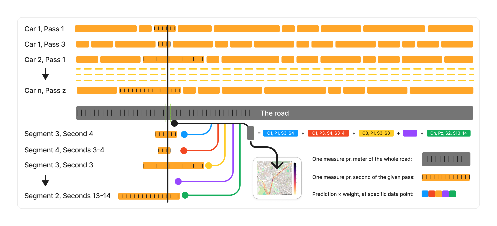
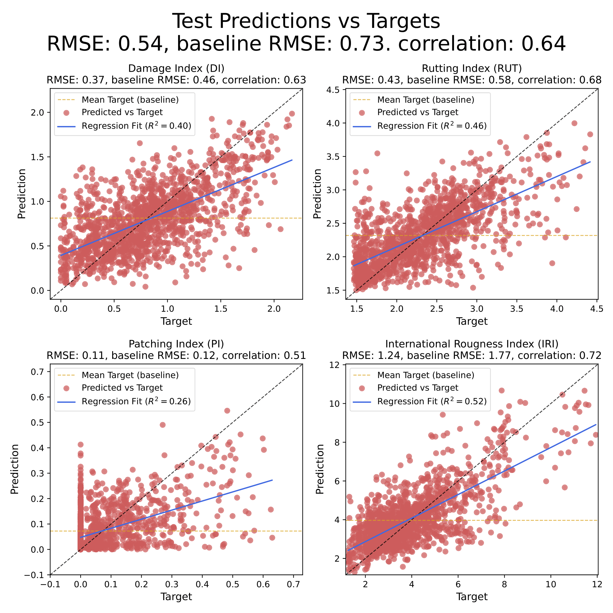
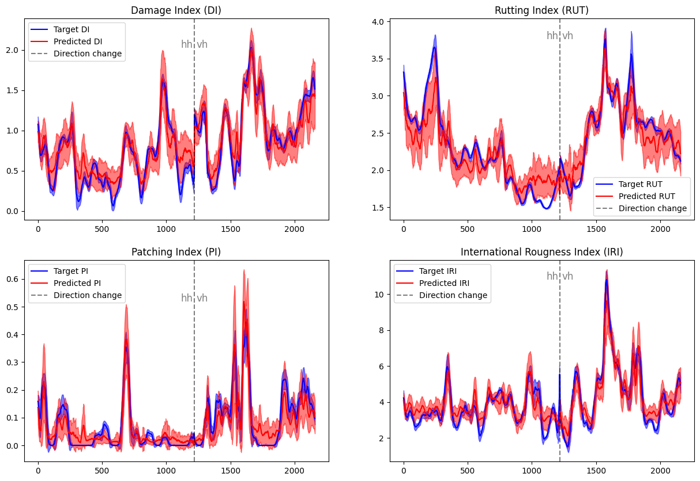

<div style="text-align:center">
    
</div>

# CrackDetect (Machine-learning approach for real-time assessment of road pavement service life based on vehicle fleet data)

[]()
[]()
[]()

(Maybe put abstract from report here)

Repository containing code for the project Machine-learning approach for real-time assessment of road pavement service life based on vehicle fleet data. Complete pipeline including data preprocessing, feature extraction, model training and prediction.

# Results
Our results are in [reports/figures/our_model_results/](reports/figures/our_model_results/).

<p align="center">
  
</p>

<p align="center">
  
</p>

# Quickstart
1. Clone this repository ```git clone https://github.com/rreezN/CrackDetect.git```
2. (Optional) Create [Virtual environment in powershell](#virtual-environment-in-powershell). Note this project requires python > 3.10
3. Install requirements ```pip install -r requirements.txt```. 
4. Download the data from [sciencedata.dk](https://sciencedata.dk/themes/deic_theme_oc7/apps/files_sharing/public.php?g=dtu.dk&t=df00c89039ec32807b9c8d794bc8e2f5&), unzip it and place it in the data folder (see [data section](#downloading-the-data))
5. Run ```python src/main.py all```

This will run all steps of the pipeline, from data preprocessing to model prediction. At the end a plot will appear that shows our (FleetYeeters) results and the results from the newly trained model. It will extract features using a Hydra model from all signals except location signals. The *main.py* script is setup to recreate our results, and thus all arguments are pre specified. 

It is possible to call *main.py* with individual steps, or beginning at a certain step. To call individual steps, you would replace all with the desired step. Possible steps are:
```shell
python src/main.py [all, make_data, extract_features, train_model, predict_model, validate_model]
```

Additionally, if you wish to start from a specific step, skipping the steps before, you can add the `--begin-from` argument, i.e. if you wish to start from predict_model you would call:
```shell
python src/main.py --begin-from predict_model
```

If you wish to go through each step manually with your own arguments, call each script directly with its own arguments:

1. Create dataset with ```python src/data/make_dataset.py all```
2. Extract features with ```python src/data/feature_extraction```
3. Train model with ```python src/train_hydra_mr.py```
4. Predict using trained model with ```python src/predict_model.py```
5. See results in ```reports/figures/model_results```

# Table of Contents
- [crackdetect (Machine-learning approach for real-time assessment of road pavement service life based on vehicle fleet data)](#crackdetect-machine-learning-approach-for-real-time-assessment-of-road-pavement-service-life-based-on-vehicle-fleet-data)
- [Results](#results)
- [Quickstart](#quickstart)
- [Table of Contents](#table-of-contents)
- [Installation](#installation)
    - [Virtual environment in powershell](#virtual-environment-in-powershell)
- [Usage](#usage)
  - [Downloading the data](#downloading-the-data)
  - [Preprocessing the data](#preprocessing-the-data)
  - [Feature extraction](#feature-extraction)
  - [Model training](#model-training)
  - [Predicting](#predicting)
- [Credits](#credits)
- [License](#license)

# Installation
[(Back to top)](#table-of-contents)

1. Clone this repository
```shell
git clone https://github.com/rreezN/CrackDetect.git
```
2. Install requirements

> **Note**: This project requires python > 3.10 to run

There are two options for installing requirements. If you wish to setup a dedicated python virtual environment for the project, follow the steps in [Virtual environment in powershell](#virtual-environment-in-powershell). If not, then simply run the following command, and all python modules required to run the project will be installed
```shell
python -m pip install -r requirements.txt
```

### Virtual environment in powershell
Have `python >= 3.10`
1. CD to CrackDetect `cd CracDetect`
2. `python -m venv fleetenv` -- Create environment
3. `Set-ExecutionPolicy -Scope CurrentUser RemoteSigned` -- Change execution policy if necessary (to be executed in powershell)
4. `.\fleetenv\Scripts\Activate.ps1` -- Activate venv
5. `python -m pip install -U pip setuptools wheel`
6. `python -m pip install -r requirements.txt`
7. ...
8. Profit

To activate venv in powershell:
```shell
.\fleetenv\Scripts\Activate.ps1
```


# Usage
[(Back to top)](#table-of-contents)

There are several steps in the pipeline of this project. Detailed explanations of each step, and how to use them in code can be found in notebooks in ```notebooks/```.

## Downloading the data
[(Back to top)](#table-of-contents)

The data is made available at [sciencedata.dk](https://sciencedata.dk/themes/deic_theme_oc7/apps/files_sharing/public.php?g=dtu.dk&t=df00c89039ec32807b9c8d794bc8e2f5&). 

Once downloaded it should be unzipped and placed in the empty ```data/``` folder. The file structure should be as follows:
- data
  - raw
    - AutoPi_CAN
      - platoon_CPH1_HH.hdf5
      - platoon_CPH1_VH.hdf5
      - read_hdf5_platoon.m
      - read_hdf5.m
      - readme.txt
      - visualize_hdf5.m
    - gopro
      - car1
        - GH012200
          - GH012200_HERO8 Black-ACCL.csv
          - GH012200_HERO8 Black-GPS5.csv
          - GH012200_HERO8 Black-GYRO.csv
        - ...
      - car3
        - ...
    - ref_data
      - cph1_aran_hh.csv
      - cph1_aran_vh.csv
      - cph1_fric_hh.csv
      - cph1_fric_vh.csv
      - cph1_iri_mpd_rut_hh.csv
      - cph1_iri_mpd_rut_vh.csv
      - cph1_zp_hh.csv
      - cph1_zp_vh.csv

## Preprocessing the data
[(Notebook)](notebooks/make_dataset.ipynb) [(Back to top)](#table-of-contents)

The data goes through several preprocessing steps before it is ready for use in the feature extractor.

1. Convert
2. Validate
3. Segment
4. Matching
5. Resampling
6. KPIs

To run all preprocessing steps
```
python src/data/make_dataset.py all
```

A single step can be run by changing `all` to the desired step (e.g. `matching`). You can also run from a step to the end by calling, e.g. from (including) `validate`:

```
python src/data/make_dataset.py --begin_from validate 
```

## Feature extraction
[(Notebook)](notebooks/feature_extraction.ipynb) [(Back to top)](#table-of-contents)

There are two feature extractors implemented in this repository: [HYDRA](https://arxiv.org/abs/2203.13652) and [MultiRocket](https://arxiv.org/abs/2102.00457). They are found in [src/models/hydra](src/models/hydra/) and [src/models/multirocket](src/models/multirocket/). 

The main feature extraction is found in [src/data/feature_extraction.py](src/data/feature_extraction.py). It has the following arguments and default parameters
- `--cols acc.xyz_0 acc.xyz_1 acc.xyz_2`
- `--all_cols` (default False)
- `--all_cols_wo_location` (default False)
- `--feature_extractor both` (choices: `multirocket`, `hydra`, `both`)
- `--mr_num_features 50000`
- `--hydra_input_length 250`
- `--subset None`
- `--name_identifier` (empty string)
- `--folds 5`
- `--seed 42`

To extract features using HYDRA and MultiRocket, call 
```shell
python src/data/feature_extraction.py
```

The script will automatically set up the feature extractors based on the amount of cols (1 = univariate, >1 = multivariate). The features will be stored in [data/processed/features.hdf5](data/processed/features.hdf5), along with statistics used to standardize during training and prediction. Features and statistics will be saved under feature extractors based on their names as defined in the model scripts.

The structure of the HDF5 features file can be seen in (LINK OR INSERT IMAGE HERE).

## Model training
[(Notebook)](notebooks/train_model.ipynb) [(Back to top)](#table-of-contents)

A simple model has been implemented in [src/models/hydramr.py](src/models/hydramr.py). 
The model training script is implemented in [src/train_hydra_mr.py](src/train_hydra_mr.py). It has the following arguments and default parameters
- `--epochs 50`
- `--batch_size 32`
- `--lr 1e-6`
- `--feature_extractors HydraMV_8_64`
- `--name_identifier` (empty string)
- `--folds 5`
- `--model_name HydraMRRegressor`
- `--weight_decay 0.0`
- `--hidden_dim 64`
- `--project_name hydra_mr_test` (for wandb)
- `--dropout 0.5`
- `--model_depth 0`
- `--batch_norm True`

To train the model using Hydra on a multivariate dataset call
```shell
python src/train_hydra_mr.py
```

The trained model will be saved in [models/](models/), along with the best model during training (based on validation loss) for each fold. The training curves are saved in [reports/figures/model_results](reports/figures/model_results/).

Trained models will be saved based on the name in their model file scripts.

## Predicting
[(Notebook)](notebooks/predict_model.ipynb) [(Back to top)](#table-of-contents)

To predict using the trained model use the script [src/predict_model.py](src/predict_model.py). It has the following arguments and default parameters
- `--model models/best_HydraMRRegressor.pt`
- `--data data/processed/features.hdf5`
- `--feature_extractors HydraMV_8_64`
- `--name_identifier` (empty string)
- `--data_type test`
- `--batch_size 32`
- `--plot_during` (default False)
- `--hidden_dim 64`
- `--fold 1`
- `--model_depth 0`
- `--batch_norm True`
- `--save_predictions` (default False)

To run the script on the saved HydraMRRegressor model, call
```shell
python src/predict_model.py
```

The model will predict on the specified data set, plot the predictions and save them in [reports/figures/model_results](reports/figures/model_results/).

# Credits
- [David Ari Ostenfeldt](https://github.com/DavidAriOstenfeldt)
- [Dennis Chenxi Zhuang](https://github.com/rreezN)
- [Kasper Niklas Kjær Hansen](https://github.com/KasperNiklas)
- [Kristian R. Møllmann](https://github.com/KristianMoellmann)
- [Kristoffer Marboe](https://github.com/KrisMarboe)

**Supervisors**
- Asmus Skar
- Tommy Sonne Alstrøm

**LiRA-CD: An open-source dataset for road condition modelling and research**
> [Asmus Skar, Anders M. Vestergaard, Thea Brüsch, Shahrzad Pour, Ekkart Kindler, Tommy Sonne Alstrøm, Uwe Schlotz, Jakob Elsborg Larsen, Matteo Pettinari](https://orbit.dtu.dk/en/publications/lira-cd-an-open-source-dataset-for-road-condition-modelling-and-r)
>
> Asmus Skar, Anders M. Vestergaard, Thea Brüsch, Shahrzad Pour, Ekkart Kindler, Tommy Sonne Alstrøm, Uwe Schlotz, Jakob Elsborg Larsen, Matteo Pettinari. 2023. LiRA-CD: An open-source dataset for road condition modelling and research. Technical University of Denmark: Geotechnics & GeologyDepartment of Environmental and Resource Engineering, Cognitive Systems, Department of Applied Mathematics and Computer Science, Software Systems Engineering Sweco Danmark A/S Danish Road Directorate.


**HYDRA: Competing convolutional kernels for fast and accurate time series classification**
> [Angus Dempster and Daniel F. Schmidt and Geoffrey I. Webb](https://arxiv.org/abs/2203.13652)
>
> Angus Dempster and Daniel F. Schmidt and Geoffrey I. Webb. HYDRA: Competing convolutional kernels for fast and accurate time series classification. 2022.


**MultiRocket: Multiple pooling operators and transformations for fast and effective time series classification**
> [Tan, Chang Wei and Dempster, Angus and Bergmeir, Cristoph and Webb, Geoffrey I](https://arxiv.org/abs/2102.00457)
> 
> Tan, Chang Wei and Dempster, Angus and Bergmeir, Christoph and Webb, Geoffrey I. 2021. MultiRocket: Multiple pooling operators and transformations for fast and effective time series classification.

Created using [mlops_template](https://github.com/SkafteNicki/mlops_template),
a [cookiecutter template](https://github.com/cookiecutter/cookiecutter) for getting
started with Machine Learning Operations (MLOps).

# License
[(Back to top)](#table-of-contents)

See [LICENSE](LICENSE)

 Copyright 2024 FleetYeeters

   Licensed under the Apache License, Version 2.0 (the "License");
   you may not use this file except in compliance with the License.
   You may obtain a copy of the License at

       http://www.apache.org/licenses/LICENSE-2.0

   Unless required by applicable law or agreed to in writing, software
   distributed under the License is distributed on an "AS IS" BASIS,
   WITHOUT WARRANTIES OR CONDITIONS OF ANY KIND, either express or implied.
   See the License for the specific language governing permissions and
   limitations under the License.
